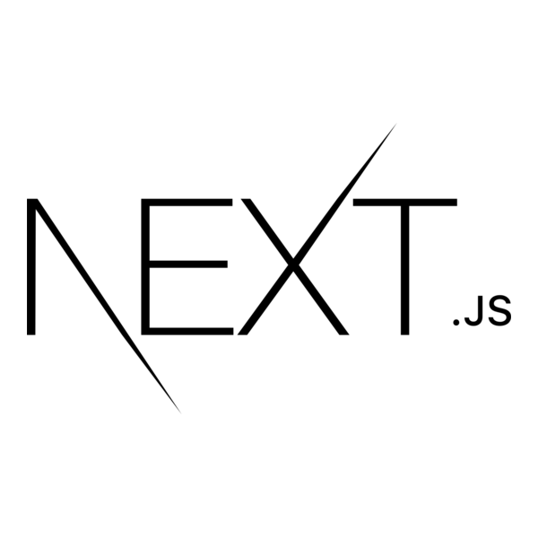
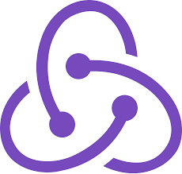
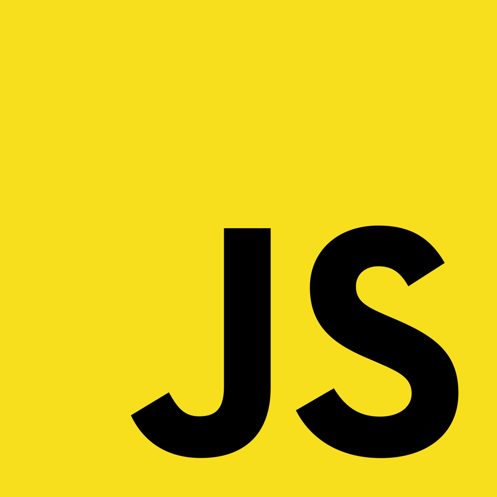
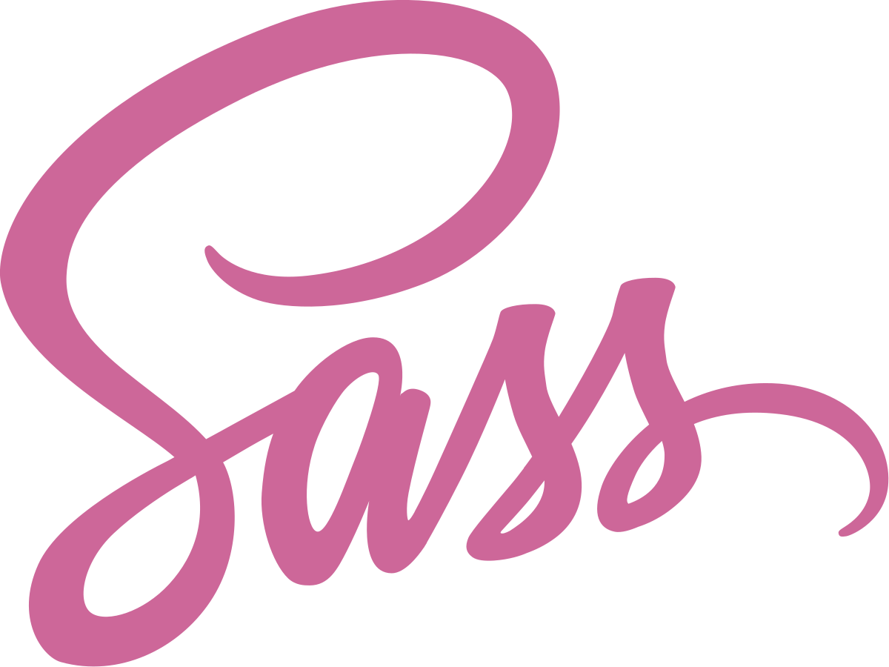
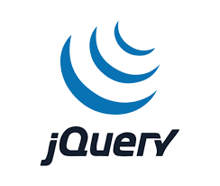

# Hi there, I'm Muhammad Fiqri 👋

Welcome to my GitHub profile! I'm a Fullstack Web Developer & Game Developer at Fiverr. Here's a bit about me:

## About Me

I'm an Agoraphobic, Hardworking, and Fast Learning guy. I love:
- Learning & teaching new stuff
- Science & Technology
- VC-ing while playing games on Discord with my friends
- Memes

I'm also a content creator on YouTube.

## My Main Skills

### Front End Web Development
- **Languages & Frameworks**: HTML, Tailwind/Sass/CSS, JavaScript/JQuery/React/Next/Vue.js & Redux.js, Streamlit

### Back End Development
- **Languages & Tools**: PHP, MariaDB, PHPMyAdmin, MySQL, Axios, PostgreSQL, Supabase, Python, Flask, Postman

### DevOps
- **Tools & Technologies**: Docker Deployment & Linux VPS (Containerize App and Deploy on Virtual Private Linux Server)

### Game Development
- **Engine**: Godot Engine

### UI/UX Design
- **Tools**: Figma, Adobe DreamWeaver

## Additional Skills
- **Video Editing**: Adobe Premiere Pro
- **Graphic Design**: Adobe Photoshop, Adobe Illustrator, Krita.
- **Motion Graphic Animation**: Adobe After Effects
- **Translation**: English <-> Indonesian

## Currently Studying
I'm currently studying at Gunadarma University majoring in Computer Science.

## Technologies & Tools

- **Front End**: React.js, Next.js, Vue.js, Redux.js, Express.js, JQuery, Javascript (ECMAScript), Tailwind CSS, Sass CSS
- **Back End**: Axios, PostgreSQL, Supabase, MySQL MariaDB (XAMPP), Flask, PHP, Python, Streamlit, Golang
- **DevOps**: Docker
- **Game Development**: Godot Engine, GDScript, Blender, Roblox Studio
- **Design**: Figma
- **Other Languages**: C++, C, C#

## Connect with Me

- **LinkedIn**: [Muhammad Fiqri](https://www.linkedin.com/in/muhammad-fiqri-b18389182/)
- **Linktree**: [fiquri](https://linktr.ee/fiquri)

Thanks for visiting my profile! Feel free to reach out if you want to collaborate on any projects or just have a chat. Have a great day! 😊

<table style="border-radius: 10px">
  <tr>
    <td>
      
    </td>
    <td>
      
    </td>
    <td>
      
    </td>
    <td>
      
    </td>
    <td>
      
    </td>
    <td>
      
    </td>
    <td>
      
    </td>
    <td>
      
    </td>
    <td>
      
    </td>
  </tr>
  <tr>
    <td>
      
    </td>
  </tr>
</table>

### Github Statistic

